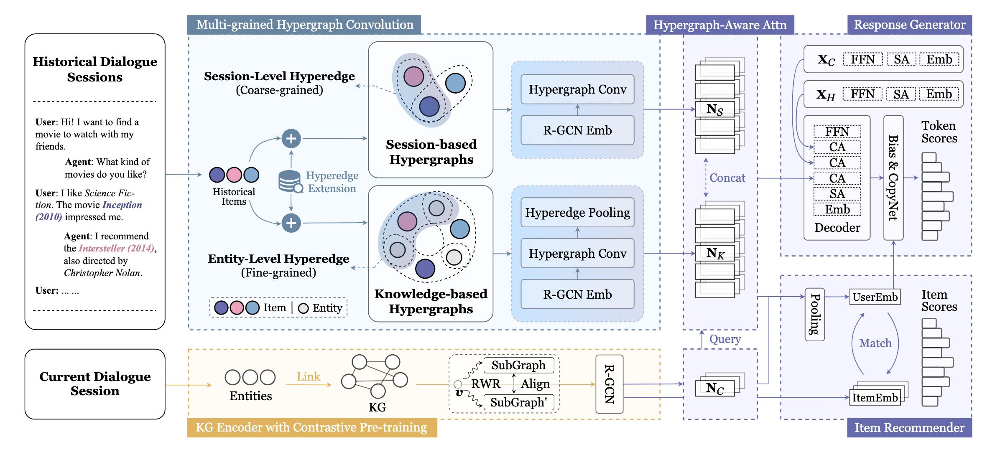

# MHIM

This is the official PyTorch implementation for the paper:

> Chenzhan Shang, Yupeng Hou, Wayne Xin Zhao, Yaliang Li, Jing Zhang. Multi-grained Hypergraph Interest Modeling for Conversational Recommendation.

## Overview

We propose **MHIM**, which stands for **M**ulti-grained **H**ypergraph **I**nterest **M**odeling for conversational recommendation. MHIM employ *hypergraph* to represent complicated semantic relations underlying intricate historical data from different perspectives. First, aiming to capture intra- and inter-session correlations among historical dialogues, we consturct a *session-based hypergraph*, which captures coarse-grained, session-level relations. Second, to alleviate the issue of data scarcity, we incorporate an external knowledge graph and construct a *knowledge-based hypergraph* considering fine-grained, entity-level semantics. We further conduct multi-grained hypergraph convolution on the two kinds of hypergraphs, and utilize the enhanced representations to develop interest-aware CRS.



## Requirements

```
python==3.8.12
pytorch==1.10.1
dgl==0.4.3
cudatoolkit==10.2.89
torch-geometric==2.0.3
transformers==4.15.0
```

## Datasets

[Google Drive](https://drive.google.com/drive/folders/1witl2Ga8pQzAsreQhj4QUH7TldzWKzLa?usp=sharing) | [百度网盘](https://pan.baidu.com/s/1WQoWOSrquIZtJz8AGfg9Cg?pwd=mhim)

Please download the processed datasets from the above links, unzip `data_contrast.zip` and move it to `Contrast/`, unzip `data_mhim.zip` and move it to `MHIM/`.

## Quick Start

### Contrastive Pre-training

Pre-train the R-GCN encoder:

```
cd Contrast
python run.py -d redial -g 0
python run.py -d tgredial -g 0
```

Then, move the `save/{dataset}/{#epoch}-epoch.pth` file to `MHIM/pretrain/{dataset}/`.

The pre-trained encoder on our machine has been saved as `MHIM/pretrain/{dataset}/10-epoch.pth`.

### Running

```
cd ../MHIM
python run_crslab.py --config config/crs/mhim/hredial.yaml -g 0 -s 1 -p -e 10
python run_crslab.py --config config/crs/mhim/htgredial.yaml -g 0 -s 1 -p -e 10
```

The experiment results on our machine has been saved in `MHIM/log/`

## Acknowledgement

The implementation is based on the open-source CRS toolkit [CRSLab](https://github.com/RUCAIBox/CRSLab).

Please cite the following papers as the references if you use our codes or the processed datasets.

```
@inproceedings{shang2023mhim,
  author = {Chenzhan Shang and Yupeng Hou and Wayne Xin Zhao and Yaliang Li and Jing Zhang},
  title = {Multi-grained Hypergraph Interest Modeling for Conversational Recommendation},
  booktitle = {{PLACEHOLDER}},
  year = {2023}
}
```

